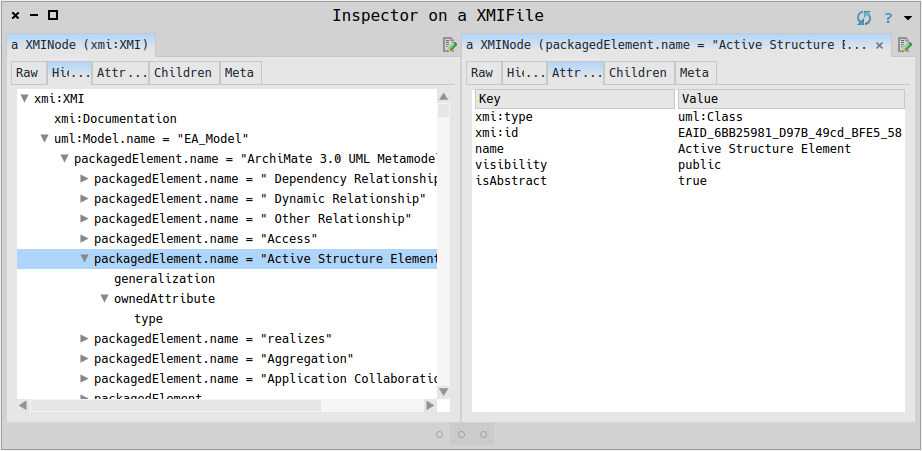

# Pharo-XMI
XML Metadata Interchange for [Pharo](https://www.pharo.org), written by Dipl.-Inf. Torsten Bergmann

[](https://www.astares.com)

[](https://www.pharo.org) 

[](https://github.com/astares/Pharo-XMI/actions/workflows/build.yml)

[](https://pharo.org/download)
[](https://pharo.org/download)
[](https://pharo.org/download)
[](https://pharo.org/download)
[](https://pharo.org/download)

Install
---------

```Smalltalk
Metacello new 
	repository: 'github://astares/Pharo-XMI/src';
	baseline: 'XMI';
	load 	
```	

Usage
---------
You can open an XMI object either from a given stream or URL
```Smalltalk
(XMIFile fromURL: 'http://www.omg.org/spec/UML/20131001/UML.xmi') inspect
```	

You can also open a file if you like:

```Smalltalk
XMIFile importFile
```	

Screenshot
---------


